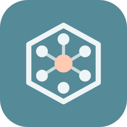
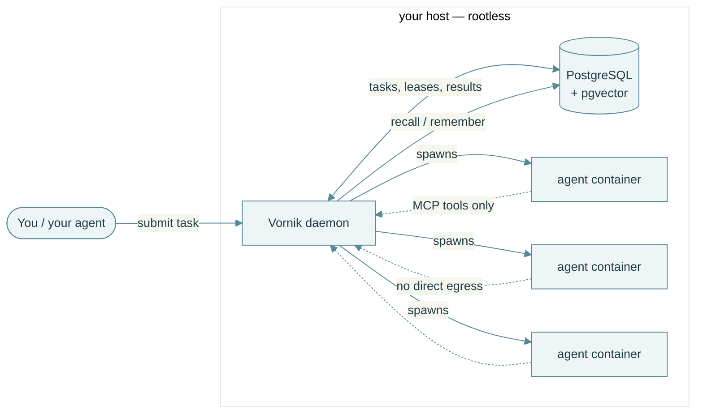
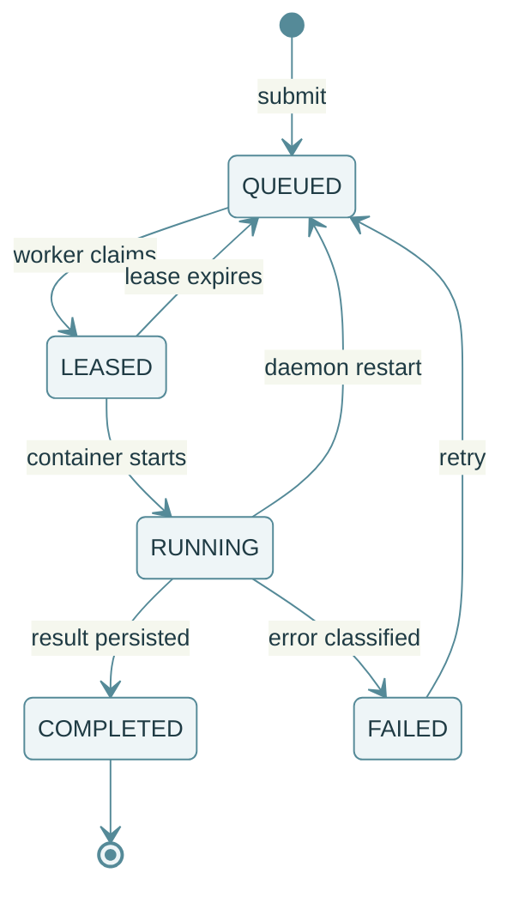
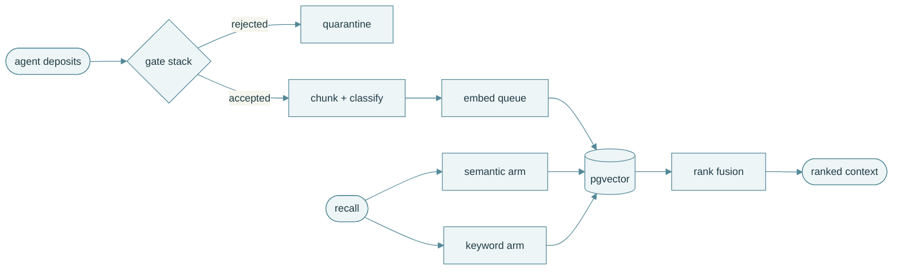
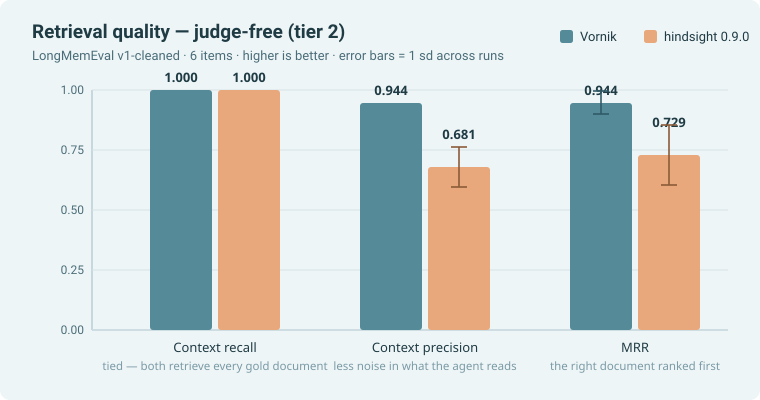
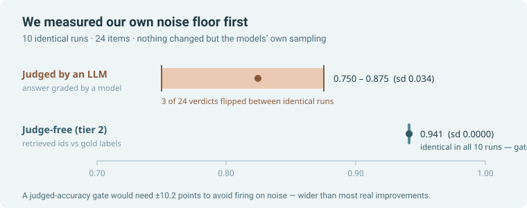

<div align="center">



# Vornik

### Give your coding agent a team.

**Vornik runs a swarm of AI agents as durable, leased tasks — on your own hardware,
in isolated containers, with no network egress by default.**

[](LICENSE)
[](https://github.com/grinco/vornik/actions/workflows/ci.yaml)
[](https://docs.vornik.io)
[](https://github.com/grinco/vornik/stargazers)

[Quick start](#quick-start) · [How it works](#how-it-works) · [Benchmarks](#benchmarks-measured-not-asserted) · [Docs](https://docs.vornik.io)

</div>

---

## Let your agent install it

Vornik is built for an AI-first workflow, starting with the install. Paste this into
Claude Code, Codex, or any coding agent with shell access:

> **Set up Vornik for me. Follow the runbook at https://agents.vornik.io**

[AGENTS.md](AGENTS.md) is an agent-executable runbook — every step is a command plus a
verifiable check. Your agent installs the stack, connects your LLM key through the
setup API, runs a hello-world task, and then **wires itself in**: its own companion
project and persistent RAG memory on your Vornik instance, asking you before anything
privileged.

That last part is the interesting bit. The agent that installed Vornik gets a place to
keep what it learns about your codebase — so the next session starts knowing what the
last one figured out.

<details>
<summary><b>Prefer to run it yourself?</b> One command, no Go toolchain needed.</summary>

<br>

```sh
curl -fsSL https://get.vornik.io | bash
```

It installs any missing prerequisites, builds the daemon + CLI in an ephemeral
container, starts PostgreSQL + pgvector, and runs Vornik as a rootless
`systemctl --user` service that spawns agent containers via rootless Podman.

The one-liner pins the **release tag baked into the script** (never a moving branch);
set `VORNIK_REF=main` for bleeding-edge. To verify the script against its published
checksum before piping it to a shell — this catches transit and redirect tampering, it
is not a signature — fetch both first:

```sh
REF=<release>  # a tag from github.com/grinco/vornik/releases that ships quickstart.sh.sha256
base="https://raw.githubusercontent.com/grinco/vornik/$REF/deployments/podman"
curl -fsSLO "$base/quickstart.sh" && curl -fsSLO "$base/quickstart.sh.sha256"
sha256sum -c quickstart.sh.sha256 && VORNIK_REF="$REF" bash quickstart.sh
```

When it finishes, open <http://localhost:8080/ui> — a first-run setup guide walks you
through connecting an LLM endpoint (with a live connection test), optional memory/RAG,
and your first project. Details and tunables:
[deployments/podman/README.md](deployments/podman/README.md).

**From source:**

```sh
git clone https://github.com/grinco/vornik && cd vornik
go build -o bin/vornik ./cmd/vornik     # the Community daemon
./bin/vornik                            # reads ./config.yaml
vornikctl init project my-project --swarm basic-swarm
vornikctl task submit -p my-project --prompt "Summarise README.md"
vornikctl task tail   -p my-project <taskId>
```

</details>

## How it works

One daemon, one database, agents in containers. Projects choose a **swarm** (who works)
and a **workflow** (how); you submit tasks and Vornik does the rest.



Agents have **no direct network egress** by default. Everything they can reach — tools,
the web, your LLM — goes through the daemon over MCP, which is what makes Vornik
workable in data-sensitive and air-gapped environments.

### Tasks are leased, not fired and forgotten

A crashed agent, a restarted daemon, or a killed container does not lose work. Leases
expire and the task returns to the queue; every transition is persisted and auditable.



### Memory that survives the session

Deposits pass a gate stack before they land, and recall fuses a semantic and a keyword
arm. This is the part the benchmarks below measure.



## Benchmarks — measured, not asserted

Vornik ships its own benchmark harness (`vornikctl bench memory`) and publishes the
numbers with their **spread**, because a mean without a spread cannot show a
regression. Every result carries a comparability key — change the dataset, the models
or the retrieval budget and two numbers refuse to be compared.



On this six-item subset **recall is tied** — both systems retrieve every gold document,
so it does not separate them. Vornik's retrieved set is tighter and better ordered; the
comparison system reaches the same recall by returning more.

We also measured how noisy our own measurement is, before quoting any of it:



That is why the judge-free tier is the headline number and judged accuracy is
supporting: a gate on the judged figure would need ±10.2 points to avoid firing on the
judge disagreeing with itself.

**[Full results, method, and how to reproduce them →](https://docs.vornik.io/benchmarks/)**
Small n, one ability, and an easy subset — the caveats are published alongside, and
`scripts/bench-reproduce.sh` runs the whole thing on your machine.

## What you get

| | |
|---|---|
| **Runs on your hardware** | One daemon, one Postgres. No SaaS, no telemetry you did not switch on. |
| **Agents are contained** | Rootless Podman, no direct egress, tools brokered over MCP. |
| **Work is durable** | Leased tasks, persisted results, classified failures, resumable runs. |
| **Memory that compounds** | pgvector RAG with a gate stack, scoped per project and per repo. |
| **Open-weight friendly** | Point it at your own endpoint — Ollama, vLLM, or a cloud API. |
| **Workflows, not prompts** | Multi-step graphs with typed steps, budgets, and approval gates. |

> **Editions.** This repository is **Vornik Community Edition** (AGPL-3.0) — the
> complete orchestration core, fully usable on its own for personal and small-team
> work. A proprietary **Enterprise Edition** adds advanced capabilities on the same
> core. See [Editions](docs/public/editions.md) for the feature matrix.

## Documentation

| Guide | What it covers |
|---|---|
| [Getting started](docs/public/getting-started.md) | Install, first run, your first task |
| [Architecture](docs/public/architecture.md) | Daemon, tasks, leases, executor, workflows, MCP |
| [Benchmarks](https://docs.vornik.io/benchmarks/) | What we measure, results by release, how to reproduce |
| [Configuration](docs/public/configuration.md) | Where config lives + the key reference |
| [CLI reference](docs/public/cli.md) | `vornik` (daemon) and `vornikctl` (control) |
| [Editions](docs/public/editions.md) | Community vs Enterprise feature matrix |
| [Contributing](docs/public/contributing.md) | Dev setup, the CLA, the PR bar |
| [Security](docs/public/security.md) | Supported versions + reporting a vulnerability |
| [Support](docs/public/support.md) | Community help and commercial support |

Full documentation: <https://docs.vornik.io>

## Requirements

- **Go** — see [`go.mod`](go.mod) for the minimum version
- **Podman** — agents run in isolated containers
- **PostgreSQL with [pgvector](https://github.com/pgvector/pgvector)** — durable task
  and project state; pgvector backs the memory/RAG vector search. SQLite runs the core
  but cannot do vector search.
- **An LLM provider** — a self-hosted open-weight endpoint, or a cloud API

```sh
make build    # go build ./...
make test     # go test ./...  (integration tests need PostgreSQL)
make lint     # gofmt + go vet
```

---

<div align="center">

**If Vornik is useful to you, a ⭐ helps other people find it.**

[AGPL-3.0](LICENSE) — © Vadim Grinco · Contributions welcome under a
[CLA](docs/public/contributing.md)

</div>
