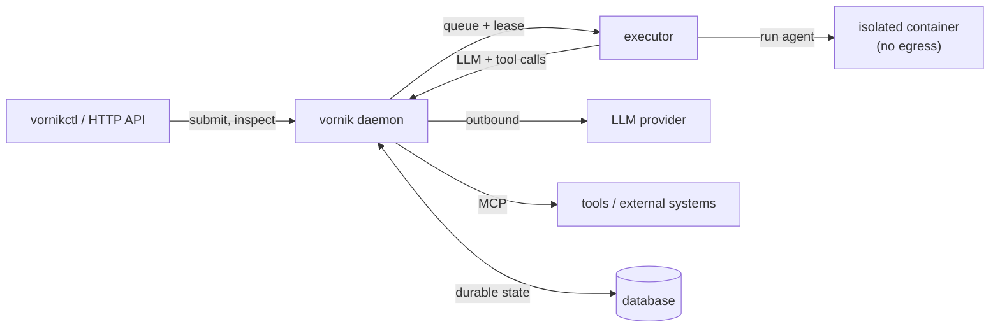

# Architecture (Community Edition)

A high-level tour of Vornik's core. This page describes the **Community** surface
only — Enterprise capabilities are listed in [editions.md](editions.md) and are
not part of this build.

## The one-process model

Vornik runs as a **single deployable daemon** (`vornik`). There is no required
sidecar; the daemon hosts the orchestration loop, the HTTP API, and the scheduler
in one process, backed by a database for durable state.

## Core concepts

- **Task** — the unit of work for an agent: a brief plus context, persisted and
  durable across daemon restarts. Tasks move through queued → leased → running →
  terminal states.
- **Lease** — a task is leased to a worker for the duration of execution. Leases
  expire and are reclaimed, so a crashed or stalled worker never silently loses
  the work — the task becomes eligible to run again.
- **Executor** — runs a leased task: it drives the LLM, applies the agent's tool
  calls, and records the outcome. Each agent runs in its own isolated container
  with no direct network egress.
- **Workflow** — composes multiple steps/tasks into a larger orchestrated unit
  (for example: plan → implement → review), with the daemon scheduling each step.
- **Project & swarm** — a project pairs a *swarm* (a team of agent roles) with a
  *workflow* and its policies. You scaffold one with `vornikctl init project`.
- **MCP** — agents reach tools and external systems over the Model Context
  Protocol; the daemon brokers these calls so the agent container needs no egress
  of its own.
- **Control plane** — `vornikctl` and the HTTP API submit tasks, inspect state,
  and manage the daemon (health, config reload, doctor).

## What stays out of Community

The orchestration core is complete and usable on its own. Capabilities such as the
learning / “instinct” layer, counterfactual replay, clustering, and the
governance / admin suite are **Enterprise** — see the matrix in
[editions.md](editions.md). The Community build registers and wires **none** of
them; they are not present in this binary.

## Further reading

- [Configuration](configuration.md)
- [CLI reference](cli.md)
