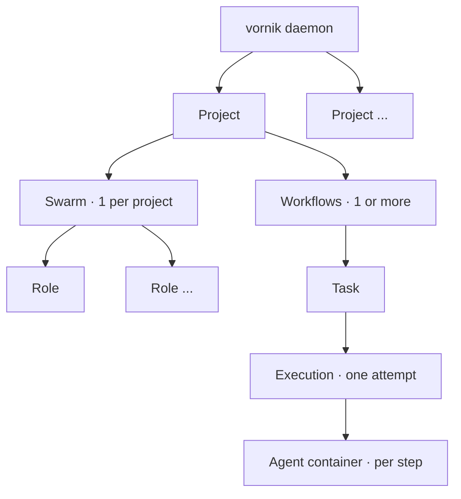

---
sources:
    - path: https://docs.vornik.io
      sha256: 69bba1cb257cf7a9abec8f1e0d4d434432716b619dc2b915c89260f9480a78cb
---
# Architecture

The [Concepts](index.md) page introduces the nouns — projects, swarms, roles,
workflows, tasks. This page steps back to the system shape: how those objects
nest, where the **control plane** ends and the **data plane** begins, where the
isolation boundary sits, and what "multiple swarms" actually means.

## The object model

- A **project** is the top-level isolation unit. It owns a queue, a swarm,
  one or more workflows, its memory, and its policies. A daemon runs many
  projects side by side.
- A project references **exactly one swarm** — its team of agent **roles** — and
  **one or more workflows**. (One swarm, many workflows: that's the cardinality
  to remember.)
- A **role** is one specialist agent: its runtime policy (ephemeral or warm),
  container image and limits, model, and permissions.
- A **workflow** is a versioned graph of steps; each agent step is assigned a
  role.
- A **task** is a unit of work submitted to a project; an **execution** is one
  runtime attempt of its workflow (a retry is a new execution). Each step runs in
  its own agent container.

## Control plane vs data plane

vornik separates the surfaces that *change how the system behaves* from the path
that *runs the work*:

- **Control plane** — the operator surfaces: the `vornikctl` CLI, the web UI, and
  the registries that hold your project / swarm / workflow definitions, plus
  policy and queue controls. This is where you change behaviour.
- **Data plane** — the execution path: the task-ingestion API, the queue and
  scheduler, the executor and its agent runtime, the delegation engine, and the
  durable state behind them. This is where work flows, asynchronously.

The control plane decides *what should happen*; the data plane *makes it happen*.
They share the same database and object store but have distinct
responsibilities, which is also what lets you split them across machines (below).

## The isolation boundary

The boundary that matters for a security review runs between the orchestrator
and the agents:

- The **orchestrator** (control + data plane) holds the database connection and
  every credential — model keys, broker keys, integration tokens.
- Each **agent** runs in its own rootless container with a per-role network
  policy that **defaults to no direct egress** (see
  [Zero-egress execution](../features/zero-egress.md)). The agent edits files in
  a scoped workspace; it does not get host access or credentials unless a role is
  explicitly granted them.
- The **project** is the logical isolation unit: separate queue, memory,
  artifacts, and policy. Projects never see each other's work except through
  explicit cross-project steps (`call_project`, `spawn_project`, `a2a_call`),
  which are the only path across the project boundary.

## Multi-swarm vs multi-node

These are two different axes, and it's worth keeping them straight:

- **Multi-swarm (logical).** One daemon coordinates many project swarms at once —
  each project has its own swarm of roles, isolated from the others. "Multiple
  swarms" means multiple agent teams on one daemon. A single project does not run
  several swarms simultaneously; it has one swarm and as many workflows as it
  needs.
- **Multi-node (physical).** One logical deployment can be spread across machines
  by giving each node a role — UI/API tier, worker tier, or a DMZ-isolated
  webhook relay — all sharing one database and object store. This scales the
  worker tier and isolates public ingress. See
  [Cluster topology and node roles](../features/cluster.md).

The two are orthogonal: multi-swarm is *how many agent teams the orchestrator
coordinates*; multi-node is *how many machines that one orchestrator runs on*.
Neither is multi-tenant SaaS, sharding, or multi-region — vornik today is a
single logical orchestrator that you can scale out across nodes.
