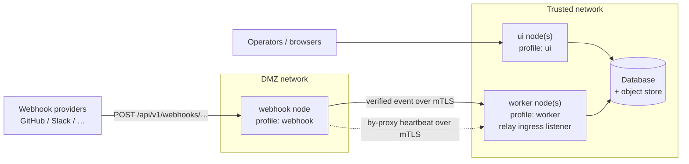

---
sources:
    - path: docs/operator/clustering.md
      sha256: 8cfeb628b598920732972e1626e04ac0666d6822cc3f4112ce3ea73b5ae1dde9
---
# Clustering and the DMZ Webhook Relay

vornik runs as a single all-in-one daemon by default, and that is the right
shape for almost every deployment. When you need to scale execution
independently or isolate public webhook ingress in a DMZ, you can split vornik
into specialised **node roles** behind a shared database and object store.

This guide walks through the role model and a complete setup of the most common
multi-node pattern: a DMZ webhook node that forwards events over mutual-TLS to a
job tier. For the high-level concept, see
[Cluster topology and node roles](../features/cluster.md); for every config key,
see the [Configuration reference](../reference/configuration.md).

---

## When to cluster

Split into roles for one of two reasons:

- **Scale the worker tier.** Run several `worker` nodes behind a shared
  PostgreSQL and object store so heavy task execution doesn't compete with
  UI/API traffic. Background singletons (schedulers, pruners) stay single-owner
  automatically via database leases.
- **Isolate webhook ingress.** Put a `webhook` node in an untrusted network
  segment. The box exposed to the public internet holds no database handle and
  no model or broker credentials — it verifies each webhook signature and
  forwards the verified event inward over mutual-TLS.

Everything behind the public edge still shares **one** database and **one**
object store. Clustering scales compute and shrinks the blast radius; it is not
a multi-region or sharding feature.

---

## Node profiles

A node's role is set with `node.profile`. Each profile is a preset over four
capabilities; you can override any one capability with `node.serve_ui`,
`node.serve_api`, `node.serve_webhooks`, or `node.run_workers`.

| `node.profile`  | Serves UI | Serves API | Serves webhooks | Runs workers | Typical use |
|-----------------|-----------|------------|-----------------|--------------|-------------|
| `all` (default) | yes       | yes        | yes             | yes          | single-node deployment |
| `ui`            | yes       | no         | no              | no           | front-end tier |
| `worker`        | no        | yes        | no              | yes          | job tier (scheduler + executor) |
| `webhook`       | no        | no         | yes             | no           | DMZ-isolated webhook relay |

A node that serves webhooks but does not run workers is a **relay node** — that
is what enables (and requires) the `node.relay` block in the walkthrough below.

---

## Reference topology

A three-tier cluster with a DMZ relay. The DMZ tier has no path to the database;
its only route inward is the mutual-TLS relay.



The webhook node verifies the provider signature at the public edge, then
forwards the verified payload over mutual-TLS to the job tier, which re-creates
the task. Because the DMZ node holds no database, it reports its liveness
**by proxy** over the same secured channel.

---

## Walkthrough: set up a DMZ webhook relay

You configure two sides — the **job tier** (server side of the mTLS seam) and
the **DMZ webhook node** (client side) — and they must trust the same CA.

### 1. Generate the mutual-TLS material

The relay is mutual-TLS: the job tier presents a server certificate, the webhook
node presents a client certificate, and each verifies the other against a shared
certificate authority. A small self-signed CA is sufficient — this trust chain
is internal to your cluster and is never seen by webhook providers. Run these in
**bash** (step 1b uses process substitution).

```bash
# 1a. A private CA for the relay.
openssl req -x509 -newkey rsa:4096 -nodes -days 3650 \
  -keyout relay-ca.key -out relay-ca.crt \
  -subj "/CN=vornik-relay-ca"

# 1b. Job-tier SERVER cert. The subjectAltName must match the host the
#     webhook node will use in node.relay.upstream (DNS name or IP:<addr>).
openssl req -newkey rsa:4096 -nodes \
  -keyout jobtier.key -out jobtier.csr \
  -subj "/CN=jobtier.internal"
openssl x509 -req -in jobtier.csr -CA relay-ca.crt -CAkey relay-ca.key \
  -CAcreateserial -days 825 -out jobtier.crt \
  -extfile <(printf "subjectAltName=DNS:jobtier.internal")

# 1c. DMZ webhook node CLIENT cert.
openssl req -newkey rsa:4096 -nodes \
  -keyout dmz-webhook.key -out dmz-webhook.csr \
  -subj "/CN=dmz-webhook-1"
openssl x509 -req -in dmz-webhook.csr -CA relay-ca.crt -CAkey relay-ca.key \
  -CAcreateserial -days 825 -out dmz-webhook.crt
```

The `subjectAltName` in step 1b is required, not cosmetic: vornik matches
`node.relay.upstream` against the server certificate's SAN, so a SAN-less
certificate fails the handshake. The client certificate needs no SAN — it is
verified by CA chain, not hostname.

### 2. Configure the job tier (server side)

On each `worker` (or `all`) node that should receive relayed webhooks, add a
`relay_ingress` block. It binds a **dedicated** mutual-TLS listener, separate
from the public API port, and accepts only client certificates signed by your
relay CA.

```yaml
# job-tier config
node:
  profile: worker
  relay_ingress:
    addr: ":8443"                    # mTLS listener for relayed webhooks
    server_cert: /etc/vornik/certs/jobtier.crt
    server_key:  /etc/vornik/certs/jobtier.key
    client_ca:   /etc/vornik/certs/relay-ca.crt   # only certs it signed are accepted
```

All four `relay_ingress` keys are required together, and the block is only valid
on a node that runs workers — the daemon refuses to start otherwise.

### 3. Configure the DMZ webhook node (client side)

The webhook node is the public edge. Four things matter:

- `node.profile: webhook` makes it a relay node.
- `node.relay.*` points it at the job tier's mTLS listener. **All four of
  `upstream`, `client_cert`, `client_key`, and `ca` are required** — the daemon
  will not start without them.
- `database.driver: sqlite`. A webhook node never writes webhook events to the
  database, but the daemon still opens a database backend at startup. Pointing it
  at a small local SQLite file keeps the DMZ box free of any database
  credential; leaving the default (`postgres`) would make a DMZ node with no
  route to the database fail to start.
- `api.auth_enabled: false`. API authentication is **on by default**, and when it
  is on the daemon requires `api.api_keys` — so a config without keys fails to
  start. A webhook node serves no bearer-authenticated API (only HMAC-verified
  webhook ingress), so turn auth off here rather than placing an API key on the
  public box. Keep your API keys on the UI/job tier, where the API is served.

```yaml
# DMZ webhook node config
server:
  address: ":8080"                   # public webhook ingress (front this with TLS)

node:
  profile: webhook
  relay:
    upstream:    https://jobtier.internal:8443   # the relay_ingress addr above
    client_cert: /etc/vornik/certs/dmz-webhook.crt
    client_key:  /etc/vornik/certs/dmz-webhook.key
    ca:          /etc/vornik/certs/relay-ca.crt   # CA that signed jobtier.crt
    max_retries: 3                    # optional; 0 → 3. Bounded retries before a 5xx to the provider
    timeout:     5s                   # optional; empty → 5s per attempt

database:
  driver: sqlite
  path:   /var/lib/vornik/relay.db    # must be on a writable mount

api:
  auth_enabled: false                 # no bearer-auth API on a webhook node; ingress is HMAC-verified
```

### 4. Run the webhook node

Use the `thin` container image for a webhook node — it carries no executor and
runs unprivileged, which is exactly what you want in a DMZ. Expose only the
webhook ingress port and put your TLS terminator in front of it; providers post
to `POST /api/v1/webhooks/{…}`.

```bash
podman run -d --name vornik-webhook-dmz \
  -p 8080:8080 \
  -v ./dmz-webhook-config.yaml:/etc/vornik/config.yaml:ro,Z \
  -v ./certs:/etc/vornik/certs:ro,Z \
  -v vornik-dmz-data:/var/lib/vornik:Z \
  --health-cmd 'wget -qO- http://localhost:8080/livez || exit 1' \
  --health-interval 30s \
  vornik:thin
```

Do not expose the metrics port (`9090`) publicly, and do not mount a container
socket — a webhook node never spawns agent containers.

---

## Validate and observe

Before starting (or restarting) any node, validate its configuration. The
cluster feature doctor confirms `node.profile` is a recognised preset and that
relay settings are coherent with the resolved role:

```bash
vornikctl doctor feature cluster
```

Once nodes are running, inspect the fleet from any node with API access:

```bash
vornikctl cluster status          # live nodes, singleton ownership, version skew
vornikctl cluster status --json   # raw response
```

The same data backs the cluster view in the admin UI. Database-backed nodes
report themselves on a timer; the DMZ webhook node reports by proxy over the
relay, and a stale node is aged out automatically. If a running webhook node is
absent from `cluster status`, the relay channel — not the node — is usually at
fault.

---

## Operating notes

- **Role and relay changes are restart-gated.** `node.profile`, `node.relay.*`,
  and `node.relay_ingress.*` are read at startup; editing them takes effect on
  the next daemon start, not on a config reload. Run the feature doctor, then
  restart.
- **Restart order.** Bring the job tier's relay listener up before the DMZ nodes
  that forward to it. While the upstream is unreachable, a webhook node reports
  not-ready on `/readyz` (so a load balancer holds traffic off it) while staying
  alive on `/livez`.
- **Backpressure.** `node.relay.max_retries` bounds retries before the webhook
  node returns a `5xx` to the provider, which then redelivers per its own policy.
  Keep retries small — provider redelivery, not in-process buffering, is the
  durability layer.
- **Certificate rotation.** Rotating the relay CA invalidates every client
  certificate at once; issue new client certs and roll the DMZ nodes. Because
  this config is restart-gated, a cert swap is a restart, not a reload.

---

## Troubleshooting

| Symptom | Likely cause | Fix |
|---|---|---|
| Won't start: "api.api_keys is required when api.auth_enabled is true" | API auth is on by default and a webhook node has no `api_keys` | Set `api.auth_enabled: false` on the webhook node; keep API keys on the UI/job tier. |
| Webhook node won't start, fails on database connect | `database.driver` left at the `postgres` default with no route to the database | Set `database.driver: sqlite` and a writable `database.path`. |
| Start-up error: "relay.{…} are all required in webhook relay mode" | Incomplete `node.relay` block on a `webhook` node | Provide all four of `upstream`, `client_cert`, `client_key`, `ca`. |
| Start-up error: "node.relay is only valid for a webhook node" | `relay.*` keys on a node that isn't a relay node | Set `node.profile: webhook`, or remove the relay keys. |
| Relay returns `401` / TLS handshake failure | Client cert not signed by the job tier's `client_ca`, or the server cert SAN doesn't match `relay.upstream` | Re-issue certs from the shared CA; match the server SAN to the upstream host. |
| Webhook node stuck not-ready (`/readyz` returns 503) | Job tier relay listener unreachable from the DMZ | Confirm the `relay_ingress` listener is up and reachable; check the `relay.upstream` host and port. |
| Webhook node missing from `cluster status` | By-proxy heartbeat not reaching the job tier | Verify the relay channel (same checks as the handshake row); the heartbeat uses the same secured path. |
